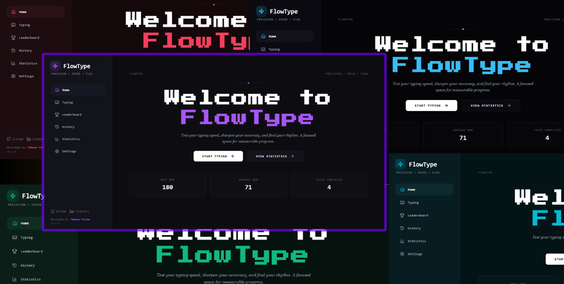

# FlowType
<p align="center">
  
</p>
**FlowType** is a modern, interactive speed-typing web application engineered for precision, speed, and focus. Built with React, Vite, Tailwind CSS v4, and Zustand, it features classic timed testing along with survival and streak-based typing mini-games.

---

## Features

- **Core Typing Modes:** Standard 15s, 30s, and 60s timed tests, plus 25-word and 50-word challenges.
- **Escape the Scorpion:** Survival mode where your typing speed keeps distance between you and a chasing scorpion.
- **Overdrive Mode:** Build high streaks to trigger score multipliers and improve your typing cadence.
- **Mirror Mode:** Challenge your focus with dynamic visual disruptions such as blackouts, glitches, and decoys.
- **Custom Atmosphere Themes:** Switch between multiple dark-aesthetic themes:
  - **Stoic:** Dark Violet
  - **Midnight:** Deep Monochrome
  - **Cyan:** Dark Aqua
  - **Emerald:** Dark Green
  - **Red:** Dark Crimson
- **Performance Telemetry:** Track real-time WPM, accuracy, errors, daily streaks, and historical statistics stored locally.

---

## Tech Stack

- **Frontend:** React 18, Vite
- **State Management:** Zustand with LocalStorage persistence
- **Styling:** Tailwind CSS v4, Custom CSS Variables
- **Icons:** Lucide React
- **Deployment:** Vercel

---

## Getting Started

### Prerequisites

- **Node.js:** `v18.0.0` or higher
- **npm:** `v9.0.0` or higher

### Installation

1. **Clone the repository:**

```bash
git clone https://github.com/MobeenFatimaa/FlowType.git
cd FlowType
```

2. **Install dependencies:**

```bash
npm install
```

3. **Start the local development server:**

```bash
npm run dev
```

4. Open your browser and navigate to:

```text
http://localhost:5173
```

---

## Project Structure

```text
FlowType/
├── public/              # Static assets
├── src/
│   ├── assets/          # Project images and icons
│   ├── components/
│   │   ├── common/      # Reusable UI components
│   │   ├── game/        # Typing engine and mode selectors
│   │   └── views/       # Home, History, Leaderboard, Settings, Stats
│   ├── data/            # Word lists and datasets
│   ├── store/           # Zustand stores
│   ├── App.jsx          # Main application layout
│   ├── index.css        # Global CSS and Tailwind imports
│   └── main.jsx         # React DOM entry point
├── package.json
├── tailwind.config.js
├── vercel.json          # Deployment configuration
└── vite.config.js
```

---

## Building for Production

Generate the production build:

```bash
npm run build
```

Preview the production build locally:

```bash
npm run preview
```

---

## License

Distributed under the MIT License. See `LICENSE` for more information.

---

## Developed By

**Mobeen Fatima**

- GitHub: https://github.com/MobeenFatimaa
